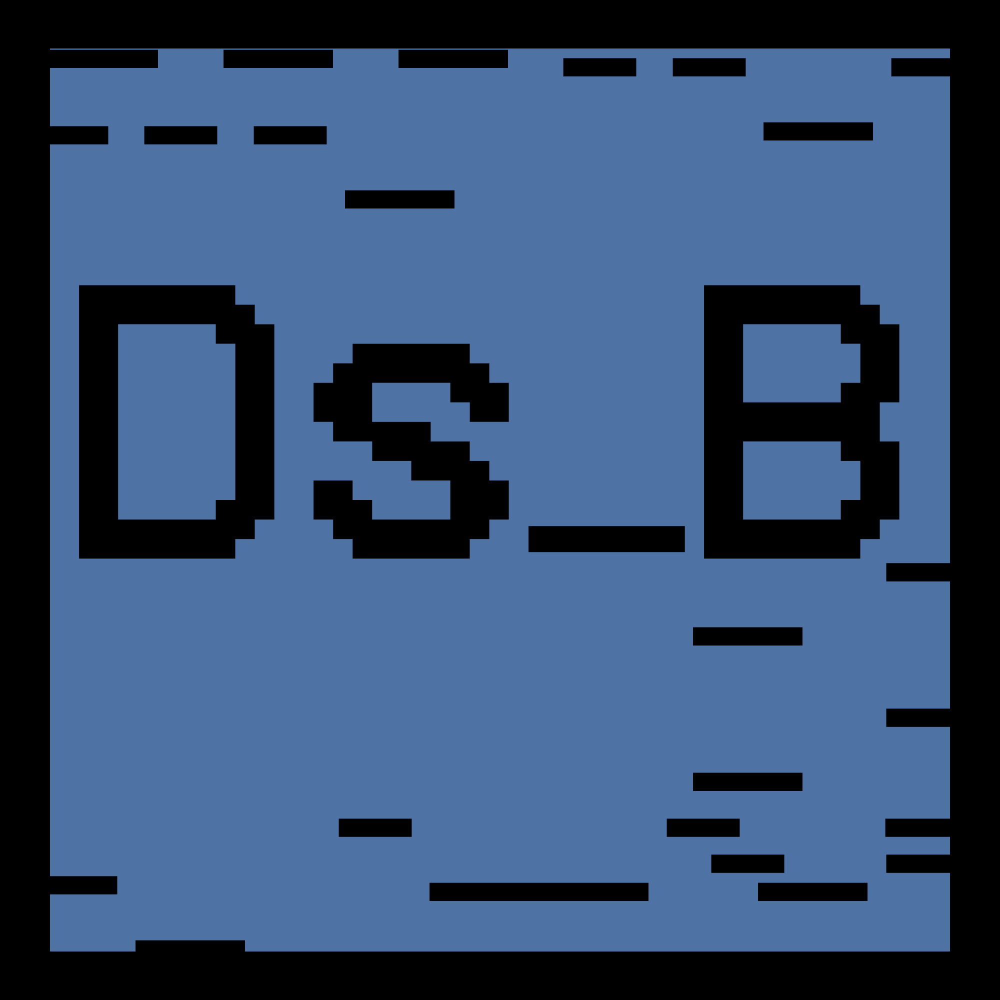
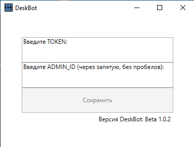

<div align="center">
  
  <h1><code>DeskBot</code></h1>
  
  **DeskBot - telegram bot for computer control**
</div>


Using
-----------
To start using DeskBot, you need to create a single text document in the same location as DeskBot.py with the following content:
```
TOKEN = Your Token
ADMIN_ID = Your Chat_ID
```
How it should look:
```
TOKEN = 4839574812:AAFD39kkdpWt3ywyRZergyOLMaJhac60qc
ADMIN_ID = 1234567890
```
And name it settings.txt

Settings.exe
-----------
If you want to utilize the capability to edit the Token and Admin ID via GUI, you will need to compile your DeskBot.py into DeskBot.exe.
<div align="center">
  
</div>

To do this, follow these steps:

- Install 'virtualenv':
```
pip install virtualenv
```

- Create a virtual environment:
```
python -m venv myenv
```

- Activate the virtual environment:
```
myenv\Scripts\activate
```

- Install dependencies:
```
pip install pyTelegramBotAPI 
pip install Pillow==9.5.0 
pip install opencv-python
pip install numpy 
pip install sounddevice scipy
pip install keyboard 
pip install pyautogui 
pip install config
```

- After completing the steps, you need to place all resulting files (including all files related to Settings.exe) in one location, then run Settings.exe

**After clicking the "Save" button, DeskBot.exe will start. Additionally, a shortcut for the DeskBot.exe program will be created in the startup folder (\AppData\Roaming\Microsoft\Windows\Start Menu\Programs\Startup).**

Commands
-----------

DeskBot provides a wide range of commands for controlling the computer.

The full list of commands is as follows:

```
/move x y - переместить мышь на указанные координаты (x, y)

/mouse - альтернатива move x y, реализуется через указания вправо|влево|вверх|вниз X (x - количество пикселей)

/click - нажать левую кнопку мыши

/rightclick - нажать правую кнопку мыши

/scroll число - прокрутить колесико мыши на указанное количество шагов (amount)

/doubleclick - двойное нажатие

/text текст который нужно ввести - для ввода в выбранную строку

/programs - запущенные программы

/screenshot - скриншот экрана

/play x - запись с микро на x сек

/switchoff - выключить пк

/setvolume x - от 0% до 100%

/ls - просмотреть файлы в текущей директории

/cd <директория> - перейти в директорию

/cd .. - вернуться в родительскую директорию

/download <имя файла> - скачивание файла

/upload - загрузка файла в текущую директорию

/delete <имя файла> - удаление файла

/photo - фото с камеры

/presskeys - нажатие определнной клавиши или сочетание клавиш через +
(чтобы получить список клавиш /presskeys help)

/open - нужно указать полный путь для открытия программы/файла или ссылку на страницу в браузере

/close - нужно указать имя программы для ее закрытия
```


Dependencies
-----------
```
pyTelegramBotAPI 
Pillow==9.5.0 
opencv-python
numpy 
sounddevice scipy
keyboard 
pyautogui 
config
virtualenv
```

FAQ
-----------
**Q: Where can I get a token for a telegram bot?**

A: Telegram: Contact [@BotFather](https://t.me/BotFather)

**Q: Where can I get the Chat_ID?**

A: Telegram: Contact [@Get My ID](https://t.me/getmyid_bot)

**Q: Do you have a telegram?**

A: Yes, [@DeskBot](https://t.me/DeskBot_telegram)
